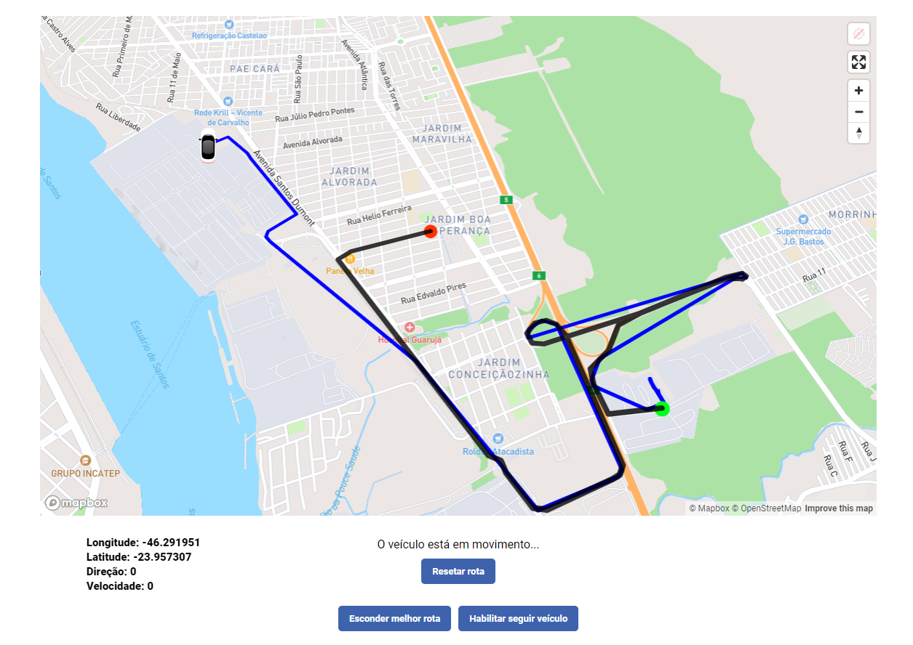
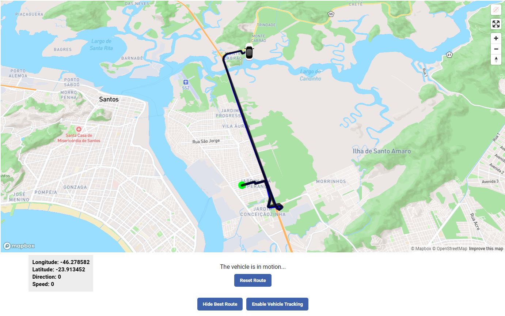
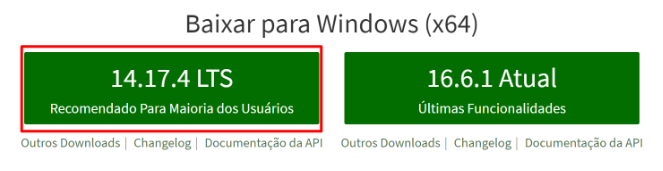
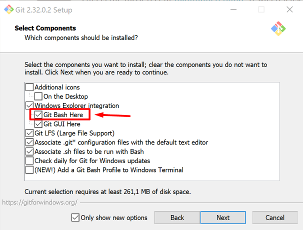
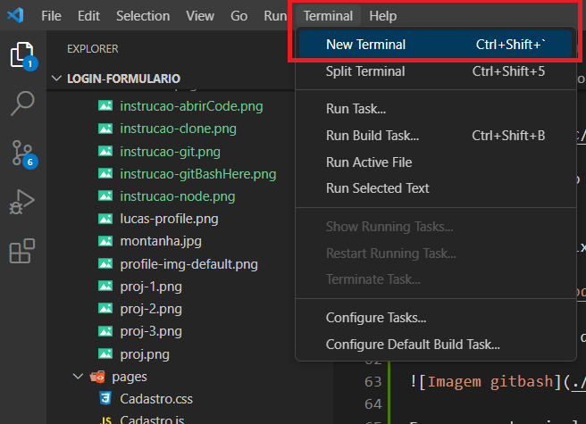
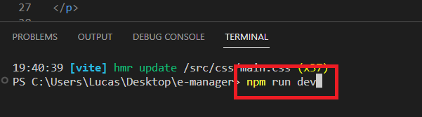

# Select Language: **English**, [Portuguese](https://github.com/santanafx/frontend-3d-car/blob/main/README-pt.md)

# Sobre o projeto

O projeto consistiu em realizar um desafio proposto pela empresa Softruck. A Softruck é uma multinacional que oferece soluções de gerenciamento com o objetivo de reduzir custos operacionais e realizar monitoramento ativo e medição de desempenho de recursos.

# O projeto

Para o desenvolvimento do projeto, foram escolhidas as seguintes tecnologias:

1. React, que é uma biblioteca amplamente utilizada do JavaScript para a construção de interfaces de usuário interativas e performáticas
2. Vite, uma ferramenta conhecida por sua velocidade e eficiência no desenvolvimento
3. TypeScript, que adiciona tipagem opcional ao JavaScript, proporcionando maior facilidade na manutenção, robustez ao código, melhor legibilidade e redução de bugs.

O projeto foi organizado em pastas, cada uma destinada a um elemento específico de acordo com sua função. A pasta "assets" armazena os arquivos de imagem do projeto. A pasta "components" segue a metodologia do Atomic Design, permitindo a criação de um sistema mais consistente e padronizado. A pasta "css" contém o arquivo "main.css" e o arquivo "main.css.map", que facilitam a depuração e manutenção do código. A pasta "styles" armazena os arquivos SCSS de todo o projeto.

Ao iniciar o projeto, uma página é carregada com um mapa obtido através do uso da API Mapbox. O mapa foi renderizado utilizando a biblioteca 'react-map-gl', que fornece componentes que possibilitam adicionar maior interação entre o usuário e o mapa. Foram adicionados os componentes 'Map', 'GeolocateControl', 'FullscreenControl' e 'NavigationControl'

1. Map, possibilita renderizar o mapa na tela.
2. GeolocateControl, possibilita o compartilhamento da localização geográfica do usuário.
3. FullscreenControl, possibilita aumentar o mapa para preencher toda a tela.
4. NavigationControl, adiciona botões de zomm in, zoom out e reset de direção (posição default norte).

Em seguida, foram criados quatro componentes do React, cujos nomes são: 'CarMarker', 'VehicleRoute', 'BestRoute' e 'Options'.

1. CarMarker renderiza um carro de acordo com a latitude, longitude, velocidade e direção, permitindo que o usuário siga automaticamente o veículo com base nas coordenadas durante a rota. Neste componente, também são exibidas informações de longitude, latitude, direção e velocidade no canto inferior esquerdo da tela.
2. VehicleRoute renderiza dinamicamente a rota do veículo (linha de cor azul) com base nas coordenadas de latitude e longitude do arquivo 'frontend_data_gps.json'. Neste componente, também são renderizados um círculo verde (ponto de início da rota) e um círculo vermelho (ponto final da rota). Os componentes 'Source' e 'Layer' da biblioteca 'react-map-gl' possibilitam a representação de pontos e linhas no mapa.
3. BestRoute renderiza a rota mais eficiente do ponto de início da rota até o ponto final da rota. O usuário pode optar por visualizar o trajeto (linha de cor preta) ou não. Neste componente, é realizada uma requisição do tipo GET para a API Mapbox Directions.
4. Options renderiza todos os botões do menu, incluindo 'Iniciar rota 1', 'Iniciar rota 2', 'Iniciar rota 3', 'Iniciar rota 4', 'Iniciar rota 5', 'Exibir melhor rota', 'Habilitar seguir veículo', 'Esconder melhor rota', 'Desabilitar seguir veículo' e 'Resetar rota'. Neste componente, também é verificado se o carro já chegou ao seu destino final ou se solicita ao usuário que escolha uma rota.

#### Imagens

#### Objetivo

No desafio foram fornecidas as seguintes instruções:

Utilizando os dados geográficos fornecidos e o sprite de dados, criar uma tela com um mapa que deve realizar a animação no sprite baseado na direção do carro.

##### Tarefa bônus

Utilizar a velocidade do veículo para definir quão rápido ele vai se mover no trajeto.

Deixar o usuário selecionar qual dos trajetos será desenhado naquele momento.

## Tecnologias e linguagens utilizadas

Typescript | React | HTML | SASS | Vite

## Bibliotecas utilizadas

1. mapbox-gl - biblioteca de mapeamento que permite criar mapas interativos e personalizados.
2. react-map-gl - biblioteca que fornece componentes React para a integração de mapas interativos. Está biblioteca funciona em conjunto com a biblioteca "mapbox-gl".
3. sass - biblioteca que permite a criação de estilos para páginas da web ou aplicativos.

## Como instalar

Para preparar o ambiente, precisaremos ter algumas coisas instaladas no computador, sendo elas:

Node.js
<a href="https://nodejs.org/pt-br">Clique aqui para instalar o Node.js</a>.

Para instalar o Node, clique no link e baixe a versão LTS (versão recomendada)
Para verificar se foi instalado corretamente, abra o terminal e escreva node -v ou node --version
alt text: site do Nodejs, com o botão da versão recomendada em foco por um quadrado vermelho!

Git
<a href="https://git-scm.com/download/windows">Clique aqui para instalar o Git</a>.

Caso não tenha um terminal de preferência, recomendo utilizar o git bash. Para instalá-lo, haverá uma opção durante a instalação do git para permitir instalar o git bash
alt text: imagem mostrando várias caixas selecionáveis. A caixa “Git Bash Here” está em evidência por um quadrado vermelho com uma seta apontada para ele

Para verificar se o git foi instalado corretamente, abra o terminal e escreva git --version
Visual Studio Code

Entre no link e baixe a versão de Windows.

<a href="https://code.visualstudio.com/download">Clique aqui para instalar o Visual Studio</a>.

Clique com o botão direito em algum local do computador e selecione a opção Git Bash Here.

Escreva no terminal o comando abaixo e no lugar de 'cole aqui' entre no projeto do GitHub e cole o link do projeto.

git clone 'cole aqui o link do projeto'

Uma pasta com o projeto desejado será adicionada a pasta em que foi escolhida.
Clique com o botão direito em cima da pasta e selecione "Abrir com Code"

Uma vez que o Visual studio estiver aberto com o projeto desejado, abra o terminal clicando no menu da aba superior e digite no terminal aberto o código "npm install" e logo em seguida digite "npm run dev". Uma janela do browser será aberta e o projeto será iniciado em seu computador.

 

# :sunglasses: Autor 

 

Lucas Santana Figueiredo

 
  
  
  

