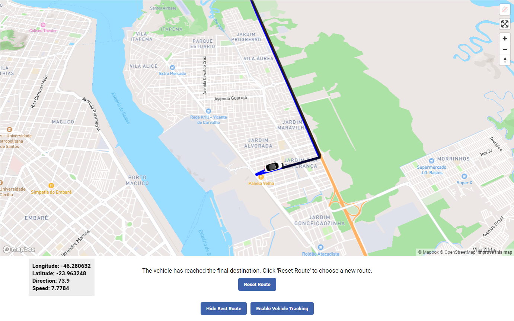
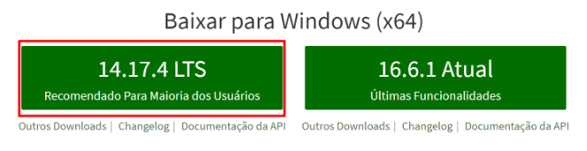
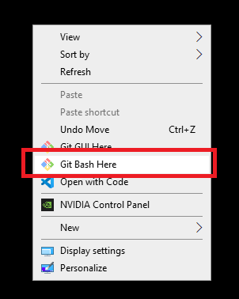
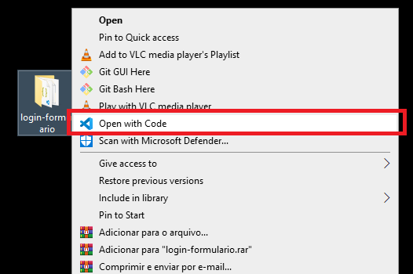

# Select Language: **English**, [Portuguese](https://github.com/santanafx/frontend-3d-car/blob/main/README-pt.md)

# About the project

The project involved taking on a challenge proposed by the company Softruck. Softruck is a multinational corporation that provides management solutions with the aim of reducing operational costs and actively monitoring and measuring resource performance.

# The project

For the development of the project, the following technologies were chosen:

1. React, which is a widely used JavaScript library for building interactive and performant user interfaces.
2. Vite, a tool known for its speed and efficiency in development.
3. TypeScript, which adds optional typing to JavaScript, providing greater ease of maintenance, code robustness, improved readability, and bug reduction

The project was organized into folders, each intended for a specific element according to its function. The "assets" folder stores project image files. The "components" folder follows the Atomic Design methodology, enabling the creation of a more consistent and standardized system. The "css" folder contains the "main.css" file and the "main.css.map" file, which facilitate code debugging and maintenance. The "styles" folder stores the SCSS files for the entire project.

When starting the project, a page is loaded with a map obtained through the use of the Mapbox API. The map was rendered using the 'react-map-gl' library, which provides components that enable greater interaction between the user and the map. The components 'Map,' 'GeolocateControl,' 'FullscreenControl,' and 'NavigationControl' were added.

1. Map enables rendering the map on the screen.
2. GeolocateControl allows sharing the user's geographic location.
3. FullscreenControl enables expanding the map to fill the entire screen.
4. NavigationControl adds buttons for zooming in, zooming out, and resetting the direction (default position north).

Next, four React components were created, named 'CarMarker,' 'VehicleRoute,' 'BestRoute,' and 'Options.'

1. CarMarker renders a car based on latitude, longitude, speed, and direction, allowing the user to automatically follow the vehicle based on coordinates during the route. This component also displays information about longitude, latitude, direction, and speed in the lower left corner of the screen.
2. VehicleRoute dynamically renders the vehicle's route (a blue line) based on latitude and longitude coordinates from the 'frontend_data_gps.json' file. In this component, a green circle (starting point of the route) and a red circle (ending point of the route) are also rendered. The 'Source' and 'Layer' components from the 'react-map-gl' library enable the representation of points and lines on the map.
3. BestRoute renders the most efficient route from the starting point of the route to the endpoint. The user can choose to view the path (a black line) or not. In this component, a GET request is made to the Mapbox Directions API.
4. Options renders all the menu buttons, including 'Start route 1,' 'Start route 2,' 'Start route 3,' 'Start route 4,' 'Start route 5,' 'Show best route,' 'Enable vehicle tracking,' 'Hide best route,' 'Disable vehicle tracking,' and 'Reset route.' In this component, it is also checked whether the car has already reached its final destination or if the user is prompted to choose a route.

#### Images

#### Goal

The challenge provided the following instructions:

Using the provided geographic data and data sprite, create a screen with a map that should perform animation on the sprite based on the direction of the car.

##### Bonus task

Utilize the vehicle's speed to determine how fast it will move along the route.

Allow the user to select which of the routes will be drawn at that moment.

## Technologies and programming languages used

Typescript | React | HTML | SASS | Vite

## Libraries used

1. mapbox-gl - A mapping library that allows you to create interactive and custom maps.
2. react-map-gl - A library that provides React components for integrating interactive maps. This library works in conjunction with the "mapbox-gl" library.
3. sass - A library that enables the creation of styles for web pages or applications.

## How to install

To set up the environment, you'll need to have the following installed on your computer:

Node.js
<a href="https://nodejs.org/">Click here to install Node.js</a>.

To install Node, click on the link and download the LTS version (recommended version).
To verify if it was installed correctly, open the terminal and type 'node -v' or 'node --version'.

Git
<a href="https://git-scm.com/download">Click here to install Git</a>.

If you don't have a preferred terminal, I recommend using Git Bash. To install it, there will be an option during the Git installation to allow installing Git Bash.
To check if Git was installed correctly, open the terminal and type 'git --version'.

Visual Studio Code

Go to the link and download the Windows version.
<a href="https://code.visualstudio.com/download">Click here to install Visual Studio</a>.

Right-click on a location on your computer and select the 'Git Bash Here' option.

In the terminal, enter the following command, replacing 'paste the project link here' with the GitHub project link:

git clone 'paste the project link here'

A folder with the desired project will be added to the selected location.
Right-click on the folder and select 'Open with Code.'

Once Visual Studio is open with the desired project, open the terminal by clicking on the menu in the top tab and type the command 'npm install,' and then type 'npm run dev.' A browser window will open, and the project will start on your computer.

 

# :sunglasses: Author 

 

Lucas Santana Figueiredo

 
  
  
  

